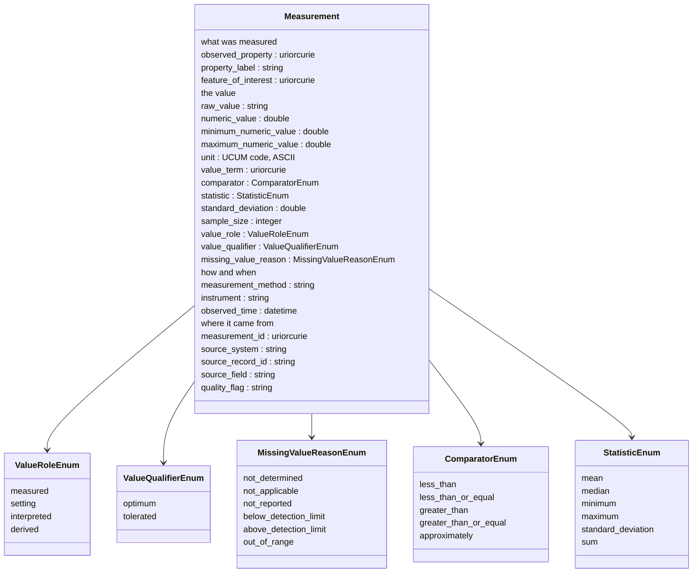
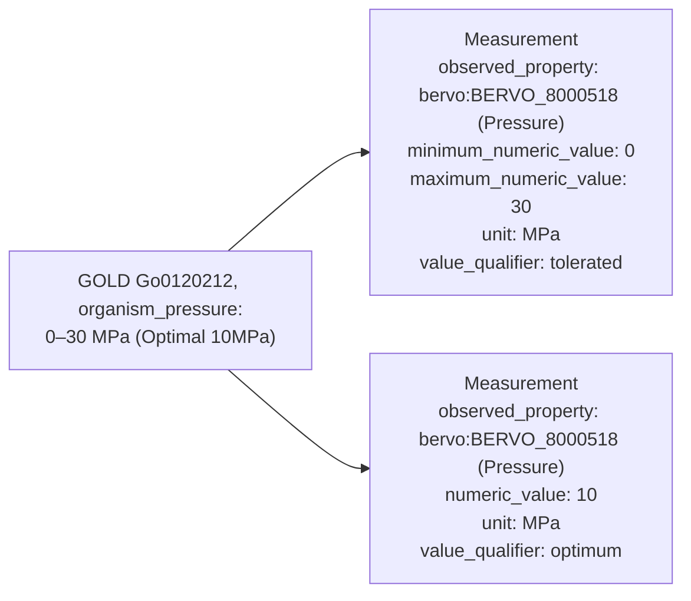
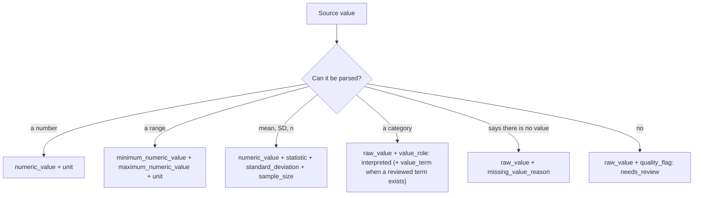
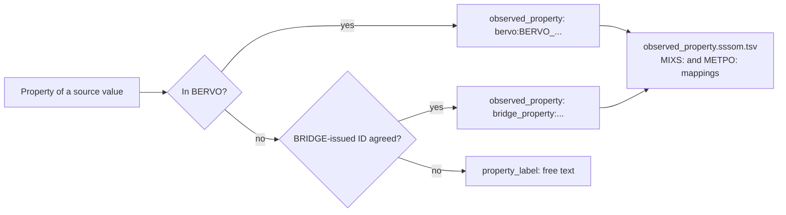

# BRIDGE Measurements hackathon, 2026-09-30: synthesis and first-pass module

At the 2026-09-30 BRIDGE Data Modeling hackathon on measurements, the group agreed to build a straw-person schema from the transcript, the brainstorm drawing and the draft module, then see whether each source can map up to it. This page is that synthesis. The schema is `src/ber_central_schema/schema/measurements.yaml` version 0.3.0. The full list of what was raised, with where each item went, is [measurements-hackathon/raised-items.md](measurements-hackathon/raised-items.md).

Inputs:

- Hackathon Notes, main tab and Report Out tab: https://docs.google.com/document/d/1_MTh8PRRG5cn2DV-b8wr9u8bu_EmChAHREfhUX4Ks9I
- The hackathon Zoom chat, saved locally by one attendee (not published)
- The "measurement brainstorm" drawing: https://docs.google.com/drawings/d/1llZ1wNabHL1A1EXYxelY62qru8Qz1tdaDvT2pdvW50Y
- The intro slides: https://docs.google.com/presentation/d/1-2ai8pYpBnytDB8-ihF4e1pK2RoUW2zGDxgOMUsPqHE
- The example data each organization put in the hackathon shared drive (JGI, NMDC, EMSL, ORNL)
- https://github.com/ber-data/bridge-central-schema/issues/4, GOLD organism measurements mapped to BRIDGE measurement draft 0.2.0
- The 10/07/2026 entry in the BRIDGE DM weekly notes: https://docs.google.com/document/d/1ezgBR6IbJNJjDntK27djICFIFNBKHeNtdgHqwELMQqU

The meeting transcript was not available when this was written. ESS-DIVE, BASALT and KBase presented but left no files in the shared drive, so their examples here come from the slides and the 0.2.0 module.

## What the group agreed

- Start with one class and add structure only when data needs it (@mslarae13 in the drawing; the 10/07 notes "slightly leaning towards one concept for now").
- A measurement needs a type, a value, a raw value and a unit (10/07 notes).
- Keep the source text, and parse numbers, ranges and units beside it (@valerie-autumn-skye, JGI notes).
- Parse and normalize once after ingest, rather than leaving it to every agent on every query (@ialarmedalien, with agreement from @sierra-moxon and @dschristianson in the chat). That is an ETL decision; the schema gives the parsed values a place to go.
- Make the schema, then map each source up to it, with a feedback loop up to a cutoff date (@corilo, @turbomam).

## The first-pass model

One class, `Measurement`. Every slot except the property is optional, but a record must name its property and carry at least one value or a reason it has none.

The rules the schema enforces, each with a counter-example in `tests/data/invalid`:

| Rule | Counter-example |
|---|---|
| Name the property with exactly one of `observed_property` or `property_label` | `Measurement-001`, `Measurement-008`, `Measurement-009` |
| Carry at least one of `raw_value`, `numeric_value`, `minimum_numeric_value`, `maximum_numeric_value`, `value_term` or `missing_value_reason` | `Measurement-003` |
| `unit` is printable ASCII (`um`, not `µm`) | `Measurement-002` |
| `numeric_value` is a number | `Measurement-004` |
| `comparator` comes from its enum | `Measurement-005` |
| `sample_size` is at least 1 | `Measurement-006` |
| `standard_deviation` is not negative | `Measurement-007` |

## How a messy source value becomes records

A source cell can hold more than one value. The parser splits it into one record per value, every record keeps the whole original cell in `raw_value`, and they share `source_record_id` and `source_field`. This GOLD pressure cell is `tests/data/valid/Measurement-005.yaml` and `Measurement-006.yaml`:

Values that cannot be parsed are kept, not dropped:

## How a record names its property

BERVO first, then a BRIDGE-issued identifier, then free text. Mappings to MIxS, METPO and other vocabularies live in `src/ber_central_schema/mappings/observed_property.sssom.tsv`, not on each record. BERVO (release 2026-09-25) carries a MIxS cross-reference on only 4 of its terms, so BRIDGE asserts most of these mappings itself.

`property_label` is the catch-all for values that fit nowhere else. It plays the same part as MIxS `misc_param` (`MIXS:0000752`), NMDC's `PropertyAssertion`, BERtron's `Attribute` and the feature model's `Attribute`. All four allow a free-text key when no identifier exists. `tests/data/valid/Measurement-020.yaml` is the MIxS and NMDC `misc_param` example (bicarbonate) as a `Measurement`.

## What changed from 0.2.0

| 0.2.0 | 0.3.0 | Why |
|---|---|---|
| `Observation`, with `Measurement` under it | `Measurement` only | One class to start (R01, R02) |
| Values in a separate `MeasurementValue` / `QuantityValue` object under `result` | Value slots directly on `Measurement` | The 10/07 notes list type, value, raw value and unit as slots of one class; one flat record per value also loads as one table row |
| `observed_property` must match `^bervo:BERVO_\d{7}$` | Any identifier, or `property_label` | Most GOLD and EMSL properties have no BERVO term yet (R38) |
| `exact_mappings` to `nmdc:QuantityValue` and `nmdc:AttributeValue` | `close_mappings`, slot by slot | NMDC requires a unit from a closed list and has min/max; this module does not require a unit (issue 4, point 6) |
| `feature_of_interest` commented out | A reference slot only | GOLD values cannot be told apart without the organism (issue 4, point 1); the classes it points to stay with the Sample working group |
| Example BERVO IDs `BERVO_0000001`, `BERVO_0000915`, `BERVO_0000123` | Real terms or BRIDGE-issued IDs | In BERVO release 2026-09-25 those three IDs are Ecosystem net radiation, Total phosphorus drainage below root zone, and an FePO4 equilibrium constant, not nitrate, total carbon and water temperature |

Names were chosen to avoid the feature model's global slots in https://github.com/ber-data/bridge-central-schema/pull/5 (`method`, `type`, `source`, `note`), hence `measurement_method` and `source_system`. Both modules define `numeric_value`; this one uses `double`, and the feature model's `Attribute.numeric_value` is `float`, which should be made to match before both are merged.

## Examples by source

| Source | Valid examples | What they show |
|---|---|---|
| NMDC | `Measurement-001` to `-003` | text instead of a number, a range, a storage temperature that is a setting |
| JGI GOLD | `Measurement-004` to `-013` | molar range, range plus optimum in one cell, mean ± SD with n, a category, not determined, two dimensions in one cell, unit taken from the column name, an unparseable value |
| EMSL MONet | `Measurement-014`, `-015` | 0.0 plus a below-detection flag (recorded as missing, not zero), an outlier kept with its flag |
| ORNL APPL | `Measurement-016`, `-017` | a derived value with its method, a placeholder instead of a value |
| BASALT | `Measurement-018` | one record per analyte column of a wide table |
| BASIN-3D | `Measurement-019` | a daily mean with its time |
| MIxS / NMDC `misc_param` | `Measurement-020` | the free-text catch-all |

Every example cites the file and row it came from. Values were copied from the source files; none were invented.

## What the data showed

Read from the files in the hackathon shared drive on 2026-10-07:

- GOLD: 48,308 of 530,610 organism rows (9.1%) carry any measurement value, which matches the roughly 9% given at the hackathon. Micrometres are written at least five ways (`um`, `µm`, `μm`, `&#956;m`, `micrometres`); 24 rows in the diameter and length columns use the HTML entity.
- EMSL MONet: below-detection values are stored as `0.0` with a flag in a parallel `flag_*` column. A parser that ignores the flag reads them as real zeros, which is why `Measurement-014` records no number.
- ORNL APPL: the unit, method and statistic sit on the variable definition, not on each value, so a loader has to copy them onto each record.
- NMDC: the export flags 29,719 values with no raw value and 196 with a minimum greater than the maximum. Those counts come from the NMDC export's own `problems` column, not from this module.

## Open questions for the group

The first pass makes a provisional choice where it can. Each needs a group decision.

1. Is a measurement a kind of observation, and when does an Observation class earn its place? (R03) Provisional: no Observation class.
2. Should `raw_value` be required? (R22) Provisional: recommended. A record needs some value or a reason it has none.
3. UCUM required, a closed unit list, or QUDT? (R30, R31) Provisional: UCUM code in printable ASCII, no list.
4. How are BRIDGE property IDs issued, and under what prefix? (R38) Provisional: `bridge_property:`, not agreed.
5. Do measurements get BRIDGE-minted IDs on ingest? (R42) Provisional: `measurement_id` is optional.
6. How are related records grouped: a mean with its SD, replicates, the parts of one cell? (R52) Provisional: shared `source_record_id` and `source_field`.
7. Who assigns `value_term` for a scientist's label such as mesophilic, and how is it reviewed? (R18)
8. Numbers that are not quantities, such as grading scales and coefficients. (R24)
9. A QA class, or is one `quality_flag` enough for now? (R64)
10. What do people want to search on? (R63)
11. (Raised while writing this pass.) Should a mapping to MIxS be `exactMatch` when MIxS defines the property of a sample and BERVO the property in general? The mapping file uses `closeMatch` for those.

## Known gaps and deferred work

- Time series (R50): `tests/data/problem/valid/Measurement-001.yaml` fails today.
- A standard deviation reported as its own record (R15) and growth derived from several OD readings (R53) have no link to the records they belong with.
- Recurring conditions such as "prescribed burn every 3-4 years" (R55) store only as text and a range.
- Sample, site and organism classes, replicates, and instrument records belong to the Project/Sample/Study/Processing working group (R40, R48, R51).
