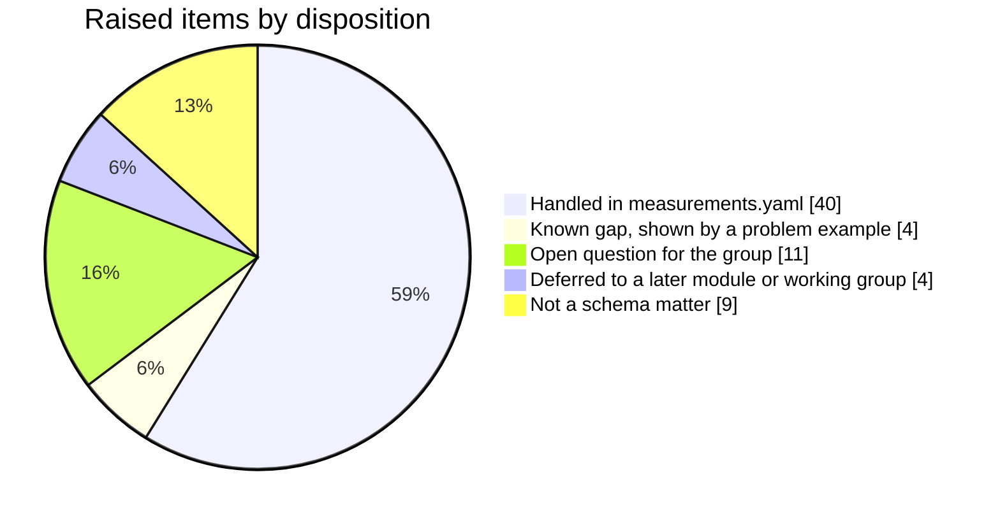
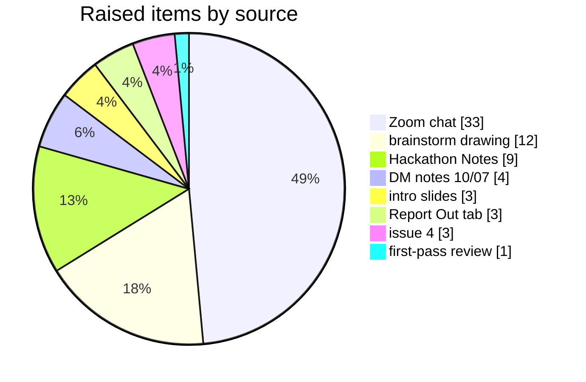

# Raised items: BRIDGE Measurements hackathon, 2026-09-30

<!-- Generated by scripts/render_raised_items.py from raised_items.yaml. Edit the YAML, not this page. -->

68 items were raised in the hackathon notes, Zoom chat, brainstorm drawing, intro slides, Report Out tab, issue 4 and the 10/07 DM notes. Each one is listed below with where it went in `measurements.yaml` 0.3.0. The synthesis is in [../measurements-hackathon-2026-09-30.md](../measurements-hackathon-2026-09-30.md).

## Where the items went

## Where the items were raised

## Handled in measurements.yaml (40)

| ID | Point | Raised by | Source | Where it went |
|---|---|---|---|---|
| R01 | Start with one class and add structure when data needs it; build a union straw-person and see what each source can conform to. | @mslarae13 | brainstorm drawing | Measurement is the only class |
| R02 | Lean towards one concept for now rather than separate Observation and Measurement classes. | BRIDGE DM team | DM notes 10/07 | Measurement is the only class; Observation and the MeasurementValue/QuantityValue split from 0.2.0 are removed |
| R04 | We may not have enough data recording observation properties to justify an Observation class. | @caufieldjh | brainstorm drawing | no Observation class |
| R05 | JGI examples would split between Observation and Measurement, and users may want to search them together. | @valerie-autumn-skye | brainstorm drawing | one class, so categorical and numeric values are searched together (valid Measurement-008) |
| R06 | The core parts are a type, a value, a raw value and a unit. | BRIDGE DM team | DM notes 10/07 | observed_property (alias measurement_type), numeric_value, raw_value, unit |
| R07 | Make a schema, then see whether each source can map up to it; feedback loop up to a cutoff date. | @corilo, @turbomam | Zoom chat | this first pass; examples from GOLD, NMDC, EMSL MONet, ORNL APPL, BASALT and BASIN-3D |
| R08 | Generic property/value model (BASIN-3D, BERtron) or named-property model (NMDC, BASALT)? | @sierra-moxon | intro slides | generic, one Measurement per value; a wide source becomes one record per column (valid Measurement-018) |
| R09 | Data is too diverse for named attributes; averages over time and space must be captured with the measurements. | @dschristianson | Hackathon Notes | generic observed_property plus statistic |
| R10 | A catch-all for values that fit nowhere else, as MIxS misc_param, NMDC PropertyAssertion and BERtron Attribute provide. | @turbomam | first-pass review | property_label (free text) as the alternative to observed_property (valid Measurement-020) |
| R11 | Ranges, such as 0.16-0.22. | @valerie-autumn-skye | Zoom chat | minimum_numeric_value, maximum_numeric_value (valid Measurement-002, -004, -012) |
| R12 | Split ranges into high and low fields. | JGI | Report Out tab | minimum_numeric_value, maximum_numeric_value |
| R13 | Two dimensions in one field (cell diameter and cell length), or are these two measurements? | @valerie-autumn-skye | Zoom chat | two Measurement records sharing source_record_id and source_field (valid Measurement-010, -011) |
| R14 | Uncertainty, such as 1.870 +/- 0.568 um (mean +/- standard deviation for 63 cells). | @valerie-autumn-skye | Zoom chat | statistic, standard_deviation, sample_size (valid Measurement-007) |
| R16 | Qualitative values, such as circumneutral pH. | @valerie-autumn-skye | Zoom chat | raw_value plus value_role interpreted; value_term for an ontology term (valid Measurement-008) |
| R17 | Instantiate categorical values (mesophilic) as observations. | @turbomam | brainstorm drawing | value_term on Measurement, since there is one class |
| R19 | Context attached to a value, such as Optimal 10MPa or "for optimal growth". | @valerie-autumn-skye | Zoom chat | value_qualifier (optimum, tolerated) (valid Measurement-005, -006) |
| R20 | Split non-measurement qualifiers (such as "optimal") into their own field. | JGI | Report Out tab | value_qualifier |
| R21 | Are some of these experimental settings rather than measurements (grew at 5 degrees for 2 hours)? Things measured versus things intended. | @turbomam | brainstorm drawing | value_role setting (valid Measurement-003) |
| R23 | Implicit NA and sentinel values (9999 meaning not in range); "not determined"; below detection. | @caufieldjh, @valerie-autumn-skye | Zoom chat | missing_value_reason, comparator (valid Measurement-001, -009, -014, -017) |
| R25 | Not all numbers have units (pH, % salinity). | @caufieldjh, @valerie-autumn-skye, @ialarmedalien | Zoom chat | unit is optional (valid Measurement-008) |
| R26 | Malformed values (107.55.82) and unitless salinity (8258) in GOLD. | @valerie-autumn-skye | Hackathon Notes | raw_value kept, no number, quality_flag needs_review (valid Measurement-013) |
| R27 | Flag ambiguous records for review. | @valerie-autumn-skye | Hackathon Notes | quality_flag |
| R28 | Retain original values (NMDC TextValue approach) while parsing typed numbers. | @valerie-autumn-skye | Hackathon Notes | raw_value beside the parsed slots |
| R29 | Allow non-Latin characters in units? um, µm and &#956; all appear. Require or coerce to UTF-8? Normalize with reasonable effort. | @turbomam, @caufieldjh, @valerie-autumn-skye | Zoom chat | raw_value keeps the source bytes; unit must be printable ASCII (invalid Measurement-002) |
| R32 | Separate the unit description from a unit ontology code. | JGI | Report Out tab | unit holds the code; the source's description stays in raw_value |
| R34 | BERVO as the dictionary of measured properties; BERVO term coverage for plant phenotypes is partial. | @sierra-moxon, @caufieldjh | Zoom chat | observed_property uses BERVO when BERVO has the term, otherwise a bridge_property identifier |
| R35 | Map to other vocabularies with SKOS-style mappings rather than importing terms (MIREOT). | @caufieldjh | Zoom chat | mappings/observed_property.sssom.tsv |
| R36 | Where does MIxS fit, in BERVO mappings? | @sierra-moxon | intro slides | MIxS terms are mapping targets in mappings/observed_property.sssom.tsv, never the observed_property value |
| R37 | KBase defined a measurement as the value of a variable_id (from a controlled vocabulary) under specified conditions. | @ialarmedalien | Zoom chat | observed_property (alias variable); conditions through value_role and value_qualifier |
| R39 | Feature of interest (plot of land, sample, organism) and its type; there are nested features. | @sierra-moxon, @valerie-autumn-skye | Hackathon Notes | feature_of_interest as a reference only; the classes it points to are deferred to the Project/Sample/Study/Processing working group |
| R41 | Not all observations are tied to a sample (air temperature at a field site). | @mslarae13 | Zoom chat | feature_of_interest accepts any identifier, or none (valid Measurement-017) |
| R43 | If each measurement is a specific event, it is not a NamedThing; NamedThing works against a domain hierarchy. | @caufieldjh, @turbomam | Zoom chat | Measurement does not inherit from NamedThing |
| R44 | Source lineage (source system, record ID, field, snapshot) so raw text stays traceable. | @valerie-autumn-skye | issue 4 | source_system, source_record_id, source_field; a snapshot slot is not added yet |
| R45 | Review the exact_mappings to NMDC QuantityValue and AttributeValue until the constraints match; add NMDC's minimum and maximum fields. | @valerie-autumn-skye | issue 4 | mappings to nmdc are close_mappings; minimum and maximum added |
| R46 | Method. NMDC pairs some slots with a method slot (ph with ph_meth, but no temp_meth); ESS-DIVE plans to add method; where does "how" live? | @bmeluch, @dschristianson, @sierra-moxon | Zoom chat | measurement_method (named to avoid the feature model's method slot) |
| R47 | BASALT has an instrument class. | @bmeluch | Zoom chat | instrument (text for now) |
| R49 | Time, with UTC offsets. | @dschristianson | Hackathon Notes | observed_time (ISO 8601 with offset) |
| R54 | Derived measurement columns (APPL visual transformer outputs); measurements are modalities. | @pranjan77 | Hackathon Notes | value_role derived (valid Measurement-016); modality is deferred to the Phenotype working group |
| R61 | METPO for categorical microbial traits. | @caufieldjh, @turbomam | Zoom chat | value_term accepts METPO terms; METPO is a mapping target for cell length and growth temperature |
| R62 | Every element should have a text description, and something should check that the description agrees with the schema and the data. | not recorded | Hackathon Notes | every class, slot, enum and value in measurements.yaml has a description; the agreement check is not built |

## Known gap, shown by a problem example (4)

| ID | Point | Raised by | Source | Where it went |
|---|---|---|---|---|
| R15 | ESS-DIVE reports a mean and a standard deviation as separate records tied by timestamp and property. | ESS-DIVE | brainstorm drawing | statistic standard_deviation exists, but nothing ties the two records (problem/valid Measurement-003) |
| R50 | Time series (loggers at 10 Hz reported per minute or per 5 minutes). Is a TimeseriesMeasurement needed on day one? | ESS-DIVE, @sierra-moxon | brainstorm drawing | one value per record only (problem/valid Measurement-001) |
| R53 | Is growth an observation, with OD as its measurement? OD measures turbidity, which says something about growth; growth is a difference between observations. | @janakagithub, @turbomam, @ialarmedalien | Zoom chat | OD readings are Measurements (BERVO Optical density); a growth value derived from several of them has no link back |
| R55 | Complicated experimental conditions entered under "other", such as "prescribed burn every 3-4 years". | @bmeluch | Zoom chat | storable as raw text with a range, but recurrence and the event are lost (problem/valid Measurement-002) |

## Open question for the group (11)

| ID | Point | Raised by | Source | Where it went |
|---|---|---|---|---|
| R03 | Is a measurement a type of observation? | @dschristianson | brainstorm drawing | Measurement has close_mappings to sosa:Observation; no Observation class until data needs one |
| R18 | A scientist-assigned label may not mean what the ontology term means (their mesophilic is not necessarily the term Mesophilic). | @caufieldjh | Zoom chat | value_role interpreted marks such values; who assigns value_term, and how it is reviewed, is undecided |
| R22 | Should raw_value be required, or may a record have a property but no result? | @caufieldjh | Zoom chat | raw_value is recommended, not required; a record needs some value or a missing_value_reason. Replies "I think we need it" (@mslarae13) and "Makes sense to me to have it too" (@dschristianson) followed at 15:25, but the chat does not show which question they answered |
| R24 | Numbers that are not quantities (latitude/longitude, grading scales, coefficients). | @caufieldjh | Zoom chat | numeric_value without a unit is allowed; latitude/longitude belong to a location model, not here |
| R30 | UCUM required or preferred? A closed list like NMDC's 136-code UnitEnum, or any valid UCUM string? | @sierra-moxon | intro slides | unit is described as UCUM and checked only for ASCII; no list yet |
| R31 | Was QUDT considered for units? QUDT is uneven in coverage. | @dschristianson, @caufieldjh, @turbomam | Zoom chat | not adopted in the first pass |
| R38 | Provisional property IDs need a policy. Also, the 0.2.0 pattern accepts only bervo:BERVO_ CURIEs while BERVO's source table writes BERVO:8000261 (found while preparing this pass). | @valerie-autumn-skye | issue 4 | pattern removed; bridge_property is a proposed prefix for BRIDGE-issued IDs, not yet agreed |
| R42 | Do all observations have unique IDs? Not in ESS-DIVE; BRIDGE could mint IDs on ingest. | @caufieldjh, @dschristianson, @mslarae13 | Zoom chat | measurement_id is optional; minting policy undecided |
| R52 | A measurement set, or an Observation holding associations between measurements; or slots grouped under a dimension. | @ialarmedalien, @caufieldjh, @dschristianson | Zoom chat | not modeled; records from one source cell share source_record_id and source_field |
| R63 | What do people want to search on at BRIDGE? | @mslarae13 | brainstorm drawing | no user research yet |
| R64 | A QA class? | not recorded | brainstorm drawing | quality_flag as a single field for now |

## Deferred to a later module or working group (4)

| ID | Point | Raised by | Source | Where it went |
|---|---|---|---|---|
| R40 | Is a sample a collection of observations, or a physical thing (dirt, a leaf)? Samples and locations are named things. | @ialarmedalien, @dschristianson, @turbomam, @mslarae13 | Zoom chat | Project/Sample/Study/Processing working group |
| R48 | Instrument resolution, such as a stated 2 standard deviations for everything from one machine. | ESS-DIVE | brainstorm drawing | belongs on an instrument record, not on each value |
| R51 | Replicates; EMSL has replicates and ranges, mostly not captured. | not recorded | brainstorm drawing | sample_size covers a summarized count; replicate structure belongs with the sample and processing model |
| R68 | Each source schema provides a mapping to the central schema; people need examples of how. | BRIDGE DM team | DM notes 10/07 | the valid examples here show one record per source; mapping worksheets per source come next |

## Not a schema matter (9)

| ID | Point | Raised by | Source | Where it went |
|---|---|---|---|---|
| R33 | Can unit normalization be handed to an AI agent, or triaged with a decision model first? | @caufieldjh | Zoom chat | curation tooling, not schema |
| R56 | Parse and normalize once, in a QA/QC step after ingest, instead of every agent doing it on every query. | @ialarmedalien, @sierra-moxon, @dschristianson | Zoom chat | ETL working group; data tiers draft |
| R57 | In practice agents mediate lakehouse access and handle measurement nuance ("let the agents deal with it"). | @ialarmedalien | Zoom chat | recorded as a position; the schema supplies the structure agents query |
| R58 | Structured metadata helps ensure metadata exists, so users' agents do not invent it. | @dschristianson | Zoom chat | recorded as a position |
| R59 | About 9% of 500k GOLD organism records have measurement metadata; standardizing it may fall to the JGI Advanced Analysis Data Modeling team, and changing the GOLD schema has met resistance. | @valerie-autumn-skye | Zoom chat | JGI organization |
| R60 | Add more fire-related terms to BERVO. | @caufieldjh | Zoom chat | BERVO development |
| R65 | The ESS-DIVE example on the slides may reflect user input rather than BASIN-3D storage. | not recorded | Hackathon Notes | correction to the slide example |
| R66 | Is the KBase upload validator a public API? Only as a platform app; its configuration is public. | @turbomam, KBase participant | Zoom chat | https://github.com/kbase/sample_service_validator_config/blob/master/metadata_validation.tsv |
| R67 | Sparse data can be brought up to type/value/unit where reasonable; data tiers are the escape hatch where not. | BRIDGE DM team | DM notes 10/07 | data tiers draft https://docs.google.com/document/d/1QVEBg6NJ_e5cXw76PwkTiSkax_ObLA7Cdnnj5FEt__M |
